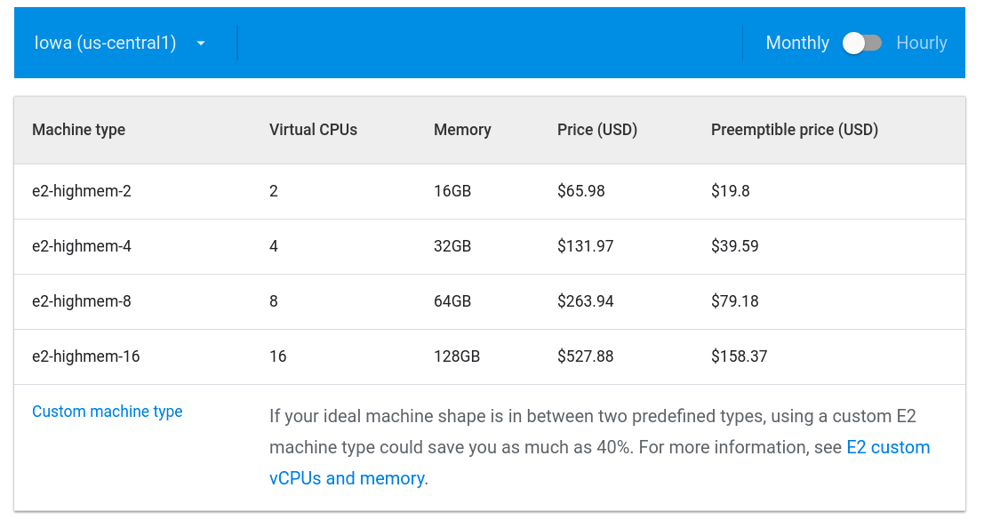
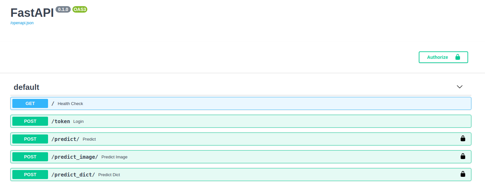
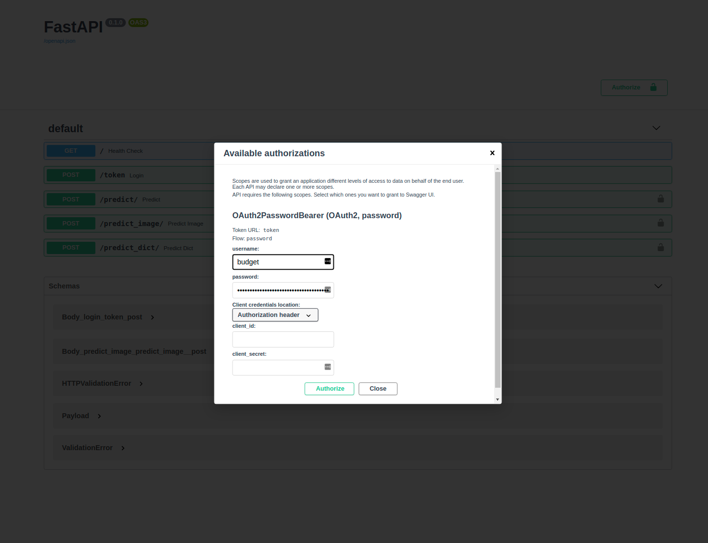
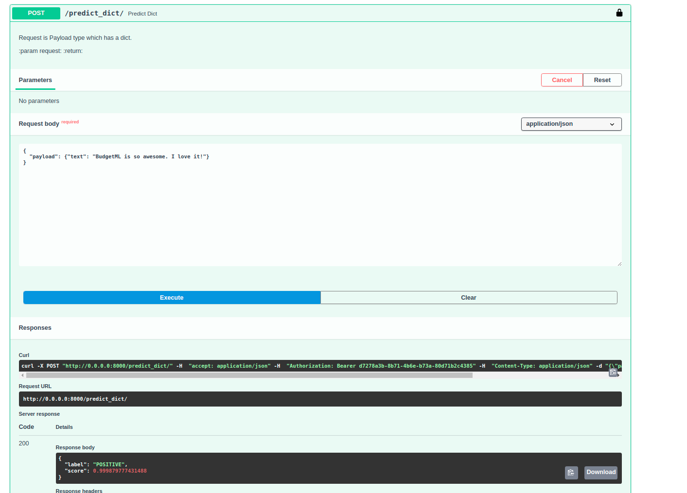

<div align="center">


---

<p align="center">
  <a href="#quickstart">Quickstart</a> •
  <a href="#installation">Installation</a> •
  <a href="https://github.com/ebhy/budgetml/discussions">Community</a>  •
  <a href="https://github.com/ebhy/budgetml/tree/main/docs">Docs</a> 
</p>

[](https://pypi.org/project/budgetml/)
[](https://pypi.org/project/budgetml/)
[](https://pepy.tech/project/budgetml)

</div>

---

<div> Give us a 
    
<b>GitHub star</b> to show your love!
</div>

---
# BudgetML - Deploy your ML model in 10 lines of code while saving 80%
BudgetML lets you deploy your model on a [Google Cloud Platform preemptible instance](https://cloud.google.com/compute/docs/instances/preemptible) 
(which is **~80% cheaper** than a regular instance) with a **secured HTTPS API** endpoint.
The tool sets it up in a way that the instance autostarts when it shuts down (at least once every 24 hours) with **only a few minutes of downtime**.
BudgetML ensures the cheapest possible API endpoint with the lowest possible downtime. 

BudgetML is perfect for practitioners who would like to quickly deploy their models to an endpoint, but not waste a lot of 
time, money, and effort trying to figure out how to do this end-to-end.

## Why?
We built BudgetML because it's hard to find a simple way to get a model in production **fast** and **cheaply**. 

* Cloud functions are limited in memory and cost a lot at scale. 

* Kubernetes clusters are an overkill for one single model. 

* Deploying from scratch involves learning too many different concepts like SSL certificate generation, Docker, REST, Uvicorn/Gunicorn, backend servers etc., that are simply not within the scope of a typical data scientist.

BudgetML is our answer to this challenge. It is supposed to be fast, easy, and developer-friendly. It is by no means meant to be used in a full-fledged 
production-ready setup. It is simply a means to get a server up and running **as fast as possible** with the **lowest costs possible**.

## Key Features
* Automatic [FastAPI](https://fastapi.tiangolo.com/) server endpoint generation (its faster than Flask).
* Fully interactive docs via [Swagger](https://swagger.io/docs/).
* Built-in SSL certificate generation via [LetsEncrypt](https://letsencrypt.org/) and [docker-swag](https://github.com/linuxserver/docker-swag).
* Uses cheap preemtible instances but has 99% uptime!
* Complete OAuth2 secured endpoints with [Password and Bearer pattern](https://fastapi.tiangolo.com/tutorial/security/simple-oauth2/).

## Cost comparison
BudgetML uses Google Cloud Preemptible instances under-the-hood to reduce costs by 80%. This can potentially mean hundreds of dollars 
worth of savings. Here is a screenshot of the `e2-highmem` GCP series, which is regular family of instances to be using for 
memory intense tasks like ML model inference functions. See the following price comparison (as of Jan 31, 2021 [[source](https://cloud.google.com/compute/vm-instance-pricing)])



Even with the lowest machine_type, there is a **$46/month** savings, and with the highest configuration this is **$370/month** savings!

## Installation
BudgetML is available for easy installation into your environment via PyPI:
```bash
pip install budgetml
```
Alternatively, if you’re feeling brave, feel free to install the bleeding edge:

**NOTE:** Do so on your own risk, no guarantees given!
```bash
pip install git+https://github.com/ebhy/budgetml.git@main --upgrade
```

## Quickstart
BudgetML aims for as simple a process as possible. First set up a predictor:

```python
# predictor.py
class Predictor:
    def load(self):
        from transformers import pipeline
        self.model = pipeline(task="sentiment-analysis")

    async def predict(self, request):
        # We know we are going to use the `predict_dict` method, so we use
        # the request.payload pattern
        req = request.payload
        return self.model(req["text"])[0]
```

Then launch it with a simple script:
```python
# deploy.py
import budgetml
from predictor import Predictor

# add your GCP project name here.
budgetml = budgetml.BudgetML(project='GCP_PROJECT')

# launch endpoint
budgetml.launch(
    Predictor,
    domain="example.com",
    subdomain="api",
    static_ip="32.32.32.322",
    machine_type="e2-medium",
    requirements=['tensorflow==2.3.0', 'transformers'],
)
```
For a deeper dive, [check out the detailed guide](examples/deploy_simple_model) in the [examples](examples) directory. For 
more information about the BudgetML API, refer to the [docs](docs).

## Screenshots
Interactive docs to test endpoints. Support for Images.


Password-protected endpoints:


Simple prediction interface:


## Projects using BudgetML
We are proud that BudgetML is actively being used in the following live products:

* [PicHance](https://pichance.com)
* [you-tldr](https://you-tldr.com)

## ZenML: For production scenarios
BudgetML is for users on a budget. If you're working in a more serious production environment, then consider using 
[ZenML](https://github.com/maiot-io/zenml) as the perfect open-source MLOPs framework for ML production needs. It does 
more than just deployments, and is more suited for professional workplaces.

## Proudly built by two brothers
We are two brothers who love building products, especially ML-related products that make life easier for people.
If you use this tool for any of your products, we would love to hear about it and potentially add it to this space.
Please get in touch [via email](mailto:htahir111@gmail.com).
